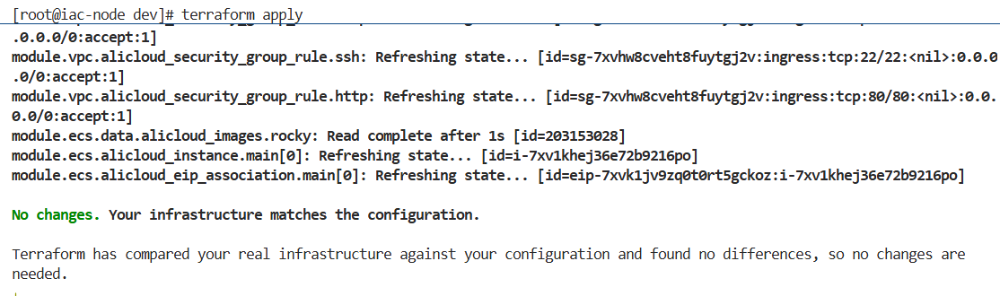
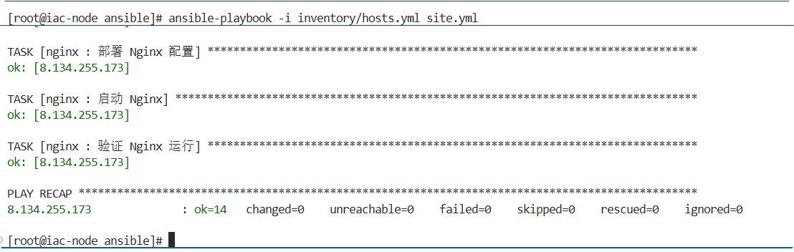
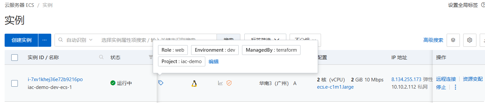
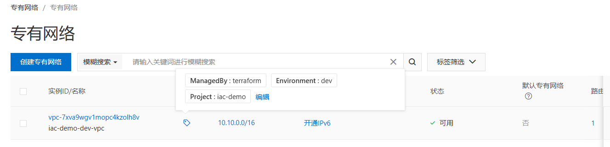
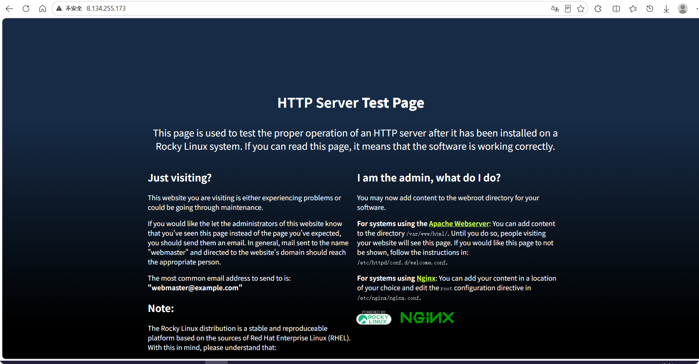

# 🏗️ 基础设施即代码（IaC）平台

> 基于 Terraform + Ansible 构建的云上基础设施自动化管理平台，实现阿里云资源的代码化管理与多环境隔离，`terraform apply` 一键拉起完整生产环境。


---

## 📌 项目背景

传统运维靠人工在控制台点点点创建云资源，无法版本控制、无法复现、无法多环境一致，本项目通过 IaC 方式解决：

- 点击创建资源 → **Terraform 代码声明，git 管理变更历史**
- 多环境配置不一致 → **模块化设计 + 变量隔离，dev / staging / prod 独立管理**
- 新服务器要手动装软件 → **Ansible 自动完成系统初始化和软件部署**
- 环境难以复现 → **`bash deploy.sh dev` 一条命令完整拉起**

---

## 🏗️ 架构设计

```text
iac-platform/
├── modules/          # 可复用模块（VPC / ECS / RDS / SLB）
├── environments/     # 三套环境，各自独立状态
│   ├── dev/          # 最小规格，开发测试用，用完即销毁
│   ├── staging/      # 接近生产规格，验证用
│   └── prod/         # 生产环境，完整配置
├── ansible/          # 服务器配置管理
└── scripts/          # 一键部署 / 销毁脚本
```

**资源创建顺序：**

```text
VPC → 交换机（公网/私网）→ 安全组 → ECS → EIP → RDS → SLB
  └────────────────────────────────────────────────────────┘
                    terraform apply 自动处理依赖顺序
```

**部署流程：**

```text
bash deploy.sh dev
      │
      ├── terraform init + plan + apply  →  云资源创建完成
      │
      ├── 等待 ECS 初始化（60秒）
      │
      ├── 自动生成 Ansible inventory
      │
      └── ansible-playbook site.yml  →  软件安装 + 配置完成
```

---

## 📁 项目结构

```text
iac-platform/
├── modules/
│   ├── vpc/
│   │   ├── main.tf          # VPC、交换机、安全组、安全组规则
│   │   ├── variables.tf
│   │   └── outputs.tf
│   ├── ecs/
│   │   ├── main.tf          # ECS实例、密钥对、EIP、初始化脚本
│   │   ├── variables.tf
│   │   └── outputs.tf
│   ├── rds/
│   │   ├── main.tf          # RDS实例、数据库、账号、授权
│   │   ├── variables.tf
│   │   └── outputs.tf
│   └── slb/
│       ├── main.tf          # SLB、HTTP监听、后端服务器组
│       ├── variables.tf
│       └── outputs.tf
├── environments/
│   ├── dev/
│   │   ├── main.tf                   # 调用模块（仅VPC + ECS）
│   │   ├── variables.tf
│   │   └── terraform.tfvars.example  # 变量模板（真实值不上传）
│   ├── staging/
│   │   ├── main.tf                   # 调用模块（VPC + ECS×2 + SLB）
│   │   ├── variables.tf
│   │   └── terraform.tfvars.example
│   └── prod/
│       ├── main.tf                   # 调用模块（VPC + ECS×2 + RDS + SLB）
│       ├── variables.tf
│       └── terraform.tfvars.example
├── ansible/
│   ├── site.yml             # 统一入口
│   ├── inventory/
│   │   └── hosts.yml        # 由 deploy.sh 自动生成
│   └── roles/
│       ├── common/          # 基础配置（时区/工具/内核参数/SSH安全）
│       ├── nginx/           # Nginx 安装 + 配置
│       └── docker/          # Docker 安装
├── scripts/
│   ├── deploy.sh            # 一键部署（Terraform + Ansible）
│   └── destroy.sh           # 一键销毁
└── README.md
```

---

## 🔧 环境规格对比

| 配置项 | dev | staging | prod |
| -------- | ----- | --------- | ------ |
| ECS 数量 | 1台 | 2台 | 2台 |
| ECS 规格 | 2核2G | 2核4G | 2核4G |
| SLB 负载均衡 | ❌ | ✅ | ✅ |
| RDS 数据库 | ❌（Docker代替） | ❌ | ✅ |
| 网段 | 10.10.0.0/16 | 10.20.0.0/16 | 10.30.0.0/16 |
| 用途 | 功能开发验证 | 上线前回归测试 | 对外生产环境 |

---

## 🚀 快速开始

### 环境要求

```bash
# 安装 Terraform
terraform version   # >= 1.6.6

# 安装 Ansible
ansible --version   # >= 2.16.3

# 配置阿里云认证 
# 阿里云控制台 → 右上角头像 → AccessKey管理 → 创建AccessKey
# 拿到 AccessKey ID 和 AccessKey Secre
export ALICLOUD_ACCESS_KEY="你的AccessKey"
export ALICLOUD_SECRET_KEY="你的SecretKey"
export ALICLOUD_REGION="cn-guangzhou"
```

### 部署 Dev 环境

```bash
# 1. 克隆项目
git clone https://github.com/你的用户名/iac-platform.git
cd iac-platform

# 2. 复制并填写变量文件
cp environments/dev/terraform.tfvars.example environments/dev/terraform.tfvars
vim environments/dev/terraform.tfvars
# 填写：admin_ip、public_key

# 3. 一键部署（约3-5分钟）
bash scripts/deploy.sh dev

# 4. 验证
curl http://输出的ECS公网IP/health

# 5. 用完销毁（省钱）
bash scripts/destroy.sh dev
```

---

## ⚙️ 模块说明

### VPC 模块

创建完整网络隔离环境：

| 资源 | 说明 |
| ------ | ------ |  
| VPC | 私有网络，CIDR 按环境隔离 |
| 公网交换机 | 放 SLB |
| 私网交换机 | 放 ECS、RDS |
| 安全组 | 80/443 对外开放，22 仅限管理员 IP |

### ECS 模块

| 配置项 | 说明 |
| -------- | ------ |  
| 镜像 | 自动查询最新 RockyLinux 系统镜像 |
| 登录方式 | 密钥对（禁用密码登录） |
| 初始化 | user_data 自动完成时区、工具安装、防火墙关闭 |
| 公网 | EIP 弹性公网 IP，按量计费 |

### Ansible Roles

| Role | 功能 |
| ------ | ------ |
| common | 时区设置、基础工具、内核参数优化、SSH 安全加固 |
| nginx | 安装 + 配置模板渲染 + 启动 + 健康验证 |
| docker | Docker CE 安装 + 镜像加速配置 |

---

## 📋 常用命令

```bash
# 预览变更（不实际执行）
cd environments/dev
terraform plan

# 查看当前资源状态
terraform show

# 查看输出值（IP 等）
terraform output

# 只销毁特定资源
terraform destroy -target=module.ecs

# 热加载 Ansible 配置（不重建资源）
ansible-playbook -i ansible/inventory/hosts.yml ansible/site.yml

# 只跑某个 Role
ansible-playbook -i ansible/inventory/hosts.yml ansible/site.yml \
  --tags nginx
```

---

## 📊 项目效果

| 指标 | 数值 |
| ------ | ------ |
| 完整环境创建时间 | 约 3~5 分钟 |
| 环境数量 | 3套（dev / staging / prod） |
| 管理资源类型 | VPC / ECS / RDS / SLB / 安全组 / EIP |
| Ansible 覆盖配置项 | 系统初始化 / Nginx / Docker |
| 环境销毁时间 | 约 2 分钟 |

| terraform apply 创建资源 |  Ansible 配置完成 |
|---------|----------|
|  |  |

|  阿里云ECS由Terraform 创建 | 阿里云VPC由Terraform 创建 |
|-------------|----------|
|  |  |
 
| 浏览器访问Nginx欢迎页IP 是从Terraform 输出中获取 |
|-----------------------|
|  |
 
---

## 🔒 安全说明

- `terraform.tfvars` 含真实密钥，已加入 `.gitignore`，**不会上传 GitHub**
- 仓库中只保留 `.tfvars.example` 模板文件
- ECS 使用密钥对登录，SSH 密码登录已禁用
- 安全组 22 端口仅对管理员 IP 开放

---

## 📎 注意事项

- 不要将 `terraform.tfvars`、状态文件和 SSH 私钥提交到仓库
- 生产环境建议配置远程后端（如 OSS）存储 Terraform 状
- 国内环境使用阿里云镜像加速 Terraform 插件和 Docker 镜像
